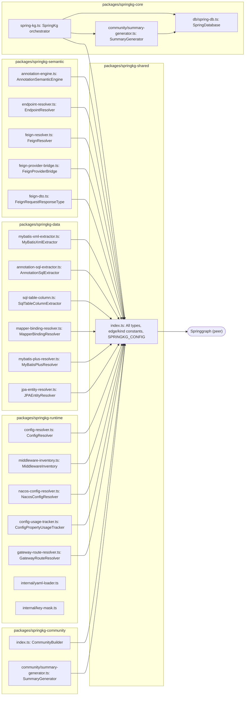

# SpringKg Architecture

## Overview

SpringKg is a knowledge graph layer on top of Springgraph that adds Spring/SpringCloud semantic understanding. It runs as a peer of Springgraph within the same project, maintaining its own SQLite database (`springkg.db`) alongside Springgraph's `springgraph.db`.

The system is structured as four layers, each owned by a dedicated team:

| Layer | Package | Owner | Responsibility |
|-------|---------|-------|---------------|
| Core | `packages/springkg-core` | Team A | Orchestration, database, resolver chain |
| Semantic | `packages/springkg-semantic` | Team B | Annotations, endpoints, Feign clients |
| Data | `packages/springkg-data` | Team C | MyBatis, JPA, SQL statements |
| Runtime | `packages/springkg-runtime` | Team D | Config properties, Nacos, middleware, routes |
| Community | `packages/springkg-community` | Team F | Feature community detection and summarization |

## System Architecture Diagram

```mermaid
graph TD
    subgraph "Layer 1 — Core (Team A)"
        A1["SpringKg (orchestrator)"]
        A2["SpringDatabase (springkg.db)"]
        A3["SpringgraphFacade (read-only wrapper)"]
    end

    subgraph "Layer 2 — Semantic (Team B)"
        B1["AnnotationSemanticEngine"]
        B2["EndpointResolver"]
        B3["FeignResolver"]
        B4["FeignProviderBridge"]
        B5["FeignRequestResponseType"]
    end

    subgraph "Layer 3 — Data (Team C)"
        C1["MyBatisXmlExtractor"]
        C2["AnnotationSqlExtractor"]
        C3["SqlTableColumnExtractor"]
        C4["MapperBindingResolver"]
        C5["MyBatisPlusResolver"]
        C6["JPAEntityResolver"]
    end

    subgraph "Layer 4 — Runtime (Team D)"
        D1["ConfigResolver"]
        D2["MiddlewareInventory"]
        D3["NacosConfigResolver"]
        D4["ConfigPropertyUsageTracker"]
        D5["GatewayRouteResolver"]
    end

    subgraph "Layer 5 — Community (Team F)"
        F1["CommunityBuilder"]
        F2["SummaryGenerator"]
    end

    subgraph "External"
        CG["Springgraph (springgraph.db)"]
        MCP["springkg-mcp (stdio)"]
        CLI["springkg CLI"]
    end

    A1 --> A2
    A1 --> A3
    A1 --> B1 & B2 & B3 & B4 & B5
    A1 --> C1 & C2 & C3 & C4 & C5 & C6
    A1 --> D1 & D2 & D3 & D4 & D5
    A1 --> F1 & F2
    A3 <--> CG
    MCP --> A1
    CLI --> A1
```



## Package Dependency Relationships



## Resolver Chain

Resolvers execute in a fixed order defined by `SPRINGKG_CONFIG.resolverChain` (packages/springkg-shared/src/index.ts):

```
annotation-engine
  -> endpoint-resolver
  -> feign-resolver
  -> feign-provider-bridge
  -> feign-request-response-type
  -> config-resolver
  -> middleware-inventory
  -> nacos-config-resolver
  -> config-property-usage-tracker
  -> gateway-route-resolver
  -> mybatis-xml-extractor
  -> annotation-sql-extractor
  -> sql-table-column
  -> mapper-binding
  -> mybatis-plus
  -> community-builder
```

The chain is divided into four execution stages:

| Stage | Resolvers | Trigger |
|-------|-----------|---------|
| Team-B-semantic | annotation-engine, endpoint-resolver, feign-resolver, feign-provider-bridge, feign-request-response-type | Sync triggered |
| Team-D-runtime | config-resolver, middleware-inventory, nacos-config-resolver, config-property-usage-tracker, gateway-route-resolver | After Team B |
| Team-C-data | mybatis-xml-extractor, annotation-sql-extractor, sql-table-column, mapper-binding, mybatis-plus | After Team D |
| Team-F-community | community-builder | After per-file resolvers |

## Data Flow

```
File change detected by Springgraph watcher
  -> Springgraph.sync() updates springgraph.db
  -> SpringKg.enhanceOnSync(paths) called with changed files
    -> For each changed file: collect Springgraph nodes via cg.getNodesInFile()
    -> For each node: collect outgoing/incoming edges
    -> Pass to resolver chain (stages execute sequentially)
    -> Each resolver emits SpringKgNodes and SpringKgEdges to springkg.db
  -> SummaryGenerator periodically scans dirty communities
```

## Database Schema Ownership

- `springgraph.db` — owned by Springgraph; SpringKg reads only
- `springkg.db` — owned by SpringKg; populated by resolver chain

SpringKg nodes store a `springgraph_node_id` column that references Springgraph's `nodes.id`, enabling cross-database joins between SpringKg and Springgraph data.
