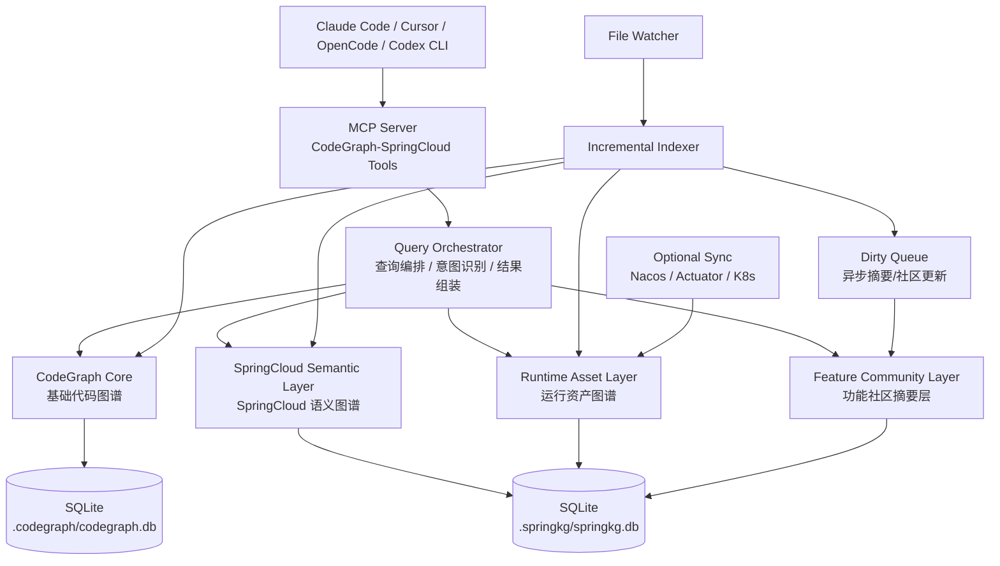

# CodeGraph-SpringCloud 设计与 Vibe Coding 实施方案

> 项目名称：**CodeGraph-SpringCloud**  
> 项目定位：基于 CodeGraph 二开的 SpringCloud 微服务代码知识图谱与 Agent 插件。  
> 目标用户：Java / SpringCloud 微服务研发团队、AI Coding Agent 用户、架构治理团队。  
> 支持对象：Claude Code、Cursor、OpenCode、Codex CLI 等支持 MCP 的编码 Agent。  

---

## 1. 项目背景

CodeGraph 已经提供了本地代码图谱底座能力，包括：

- 本地运行，无需外部服务。
- SQLite + FTS5 存储代码图谱。
- tree-sitter 解析代码结构。
- MCP Server 给 Agent 使用。
- 文件 watcher 监听代码变化。
- 自动增量索引。
- 支持 Claude Code、Cursor、OpenCode、Codex CLI 等工具。

但是 CodeGraph 当前更偏 **通用代码图谱**，还不是专门面向 SpringCloud 微服务的知识图谱工具。

SpringCloud 项目中真正影响开发效率的内容包括：

- Controller / Endpoint 入口。
- Service / Mapper / Feign 调用链。
- MyBatis XML 与 SQL 表字段关系。
- MapStruct DTO / Entity / VO 字段映射。
- Nacos 配置与服务发现。
- Gateway 路由。
- MQ、定时任务、事务、缓存、安全、AOP 等运行语义。
- 服务列表、中间件列表、配置资产与运行拓扑。
- 功能模块 / 社区摘要检索。

因此，CodeGraph-SpringCloud 的目标不是重复实现 CodeGraph，而是在 CodeGraph 之上构建 **SpringCloud 专项语义层、运行资产层和功能社区摘要层**。

---

## 2. 项目目标

### 2.1 核心目标

CodeGraph-SpringCloud 需要实现以下能力：

1. **服务入口查找**  
   按 URL、Controller、MQ Topic、定时任务、Feign 接口查找入口。

2. **调用链追踪**  
   追踪 Endpoint → Controller → Service → Mapper / Feign / MQ / DB。

3. **修改影响分析**  
   分析方法、字段、DTO、Entity、配置项变更后影响哪些接口、服务、SQL、表、Feign、MQ、测试。

4. **SpringCloud 运行资产抽取**  
   抽取服务列表、中间件列表、配置项、Nacos、Gateway、MQ、数据库、Redis、ES、MinIO 等资产。

5. **功能模块检索**  
   基于社区发现 / 聚类 / 摘要，实现“订单取消功能在哪”“支付回调模块怎么设计”等自然语言功能检索。

6. **Agent 插件化**  
   通过 MCP 暴露能力，供 Claude Code、Cursor、OpenCode、Codex CLI 等使用。

7. **低成本增量更新**  
   代码频繁修改后，只重建变更文件相关图谱，摘要和社区异步更新。

---

## 3. 总体架构设计



---

## 4. 分层设计

### 4.1 第一层：CodeGraph Core 基础热索引层

复用 CodeGraph 原能力：

- 文件索引。
- 类 / 接口 / 方法 / 字段解析。
- import / extends / implements / calls 等基础关系。
- SQLite + FTS5 本地存储。
- MCP Server。
- 文件 watcher。
- 增量更新。
- callers / callees / impact / node / explore 等基础查询。

这一层不建议重写，只做最小侵入扩展。

---

### 4.2 第二层：SpringCloud Semantic Layer 微服务语义图谱层

新增 SpringCloud 专项实体和关系。

#### 核心实体

```text
Controller
RestController
Endpoint
Service
Repository
Mapper
MapperMethod
MyBatisXmlStatement
SQLStatement
Table
Column
FeignClient
FeignMethod
RemoteService
Entity
DTO
VO
MapStructMapper
MapStructMappingMethod
MQListener
ScheduledJob
TransactionalMethod
SecurityRule
AopAspect
CacheOperation
```

#### 核心关系

```text
Endpoint -[:HANDLED_BY]-> ControllerMethod
ControllerMethod -[:CALLS]-> ServiceMethod
ServiceMethod -[:CALLS]-> MapperMethod
MapperMethod -[:EXECUTES_SQL]-> SQLStatement
SQLStatement -[:READS_TABLE]-> Table
SQLStatement -[:WRITES_TABLE]-> Table
SQLStatement -[:USES_COLUMN]-> Column

ServiceMethod -[:CALLS_FEIGN]-> FeignMethod
FeignMethod -[:BELONGS_TO]-> FeignClient
FeignClient -[:TARGETS]-> RemoteService
FeignMethod -[:TARGETS_ENDPOINT]-> ProviderEndpoint

Entity -[:MAPS_TO]-> Table
EntityField -[:MAPS_TO]-> Column
MapStructMappingMethod -[:MAPS_FIELD]-> FieldMapping

Method -[:HAS_TRANSACTION]-> TransactionBoundary
Method -[:REQUIRES_PERMISSION]-> SecurityRule
Method -[:ADVISED_BY]-> AopAspect
Method -[:READS_CACHE]-> CacheOperation
Method -[:WRITES_CACHE]-> CacheOperation
```

---

### 4.3 第三层：Runtime Asset Layer 运行资产图谱层

负责抽取：

- 服务列表。
- 中间件列表。
- Nacos 注册中心。
- Nacos 配置中心。
- Gateway 路由。
- 配置文件。
- 环境 profile。
- MQ Topic / Queue。
- 数据库 / Redis / Elasticsearch / MinIO 等中间件。
- Docker / docker-compose / Kubernetes 部署信息。

#### 核心实体

```text
MicroService
Profile
ConfigFile
ConfigProperty
NacosCluster
NacosNamespace
NacosConfig
NacosService
GatewayRoute
Middleware
DataSource
RedisInstance
MQTopic
ExternalSystem
DeploymentUnit
RuntimeEnvironment
```

#### 核心关系

```text
MicroService -[:HAS_PROFILE]-> Profile
MicroService -[:LOADS_CONFIG]-> ConfigFile
MicroService -[:LOADS_NACOS_CONFIG]-> NacosConfig
NacosConfig -[:DEFINES]-> ConfigProperty
ConfigProperty -[:USED_BY]-> Class / Method / Bean
ConfigProperty -[:CONFIGURES]-> Middleware

MicroService -[:REGISTERS_TO]-> NacosCluster
MicroService -[:REGISTERED_AS]-> NacosService
FeignClient -[:DISCOVERS]-> NacosService

MicroService -[:CONNECTS_TO]-> DataSource
MicroService -[:CONNECTS_TO]-> RedisInstance
MicroService -[:PRODUCES]-> MQTopic
MicroService -[:CONSUMES]-> MQTopic

GatewayRoute -[:ROUTES_TO]-> MicroService
GatewayRoute -[:MATCHES_PATH]-> Endpoint
```

---

### 4.4 第四层：Feature Community Layer 功能社区摘要层

负责实现“功能模块检索”。

#### 摘要层级

```text
Method Summary
Class Summary
Endpoint Summary
Service Summary
Runtime Asset Summary
Feature Community Summary
```

#### FeatureCommunity 内容

每个功能社区应包含：

- 模块名称。
- 业务关键词。
- 模块职责。
- 主要入口。
- 核心 Controller。
- 核心 Service。
- 核心 Mapper。
- 涉及表。
- 涉及 FeignClient。
- 涉及 MQ Topic。
- 涉及中间件。
- 关键配置。
- 事务 / 权限 / 缓存 / AOP 风险点。
- 常见修改点。

#### 检索流程

用户问题：

```text
订单取消功能在哪里？
```

系统流程：

```text
1. spring_search_feature 召回功能社区
2. 展开社区入口 Endpoint
3. 追踪 Controller → Service → Mapper / Feign / MQ
4. 补充表、配置、中间件
5. 返回建议修改面
```

---

## 5. 存储设计

### 5.1 存储策略

第一版建议使用双库模式：

```text
.codegraph/codegraph.db      # CodeGraph 原始基础图谱
.springkg/springkg.db        # SpringCloud 语义与运行资产图谱
```

优点：

- 不污染 CodeGraph 原始 schema。
- 便于跟进 CodeGraph 上游。
- SpringCloud 扩展自由。
- 方便后续独立发布。

### 5.2 关键表设计

#### spring_symbols

```sql
CREATE TABLE spring_symbols (
  id TEXT PRIMARY KEY,
  codegraph_node_id TEXT,
  kind TEXT NOT NULL,
  name TEXT,
  qualified_name TEXT,
  file_path TEXT,
  start_line INTEGER,
  end_line INTEGER,
  metadata_json TEXT,
  updated_at INTEGER
);
```

#### spring_edges

```sql
CREATE TABLE spring_edges (
  id TEXT PRIMARY KEY,
  source_id TEXT NOT NULL,
  target_id TEXT NOT NULL,
  kind TEXT NOT NULL,
  weight REAL DEFAULT 1.0,
  provenance TEXT,
  metadata_json TEXT,
  updated_at INTEGER
);
```

#### spring_endpoints

```sql
CREATE TABLE spring_endpoints (
  id TEXT PRIMARY KEY,
  service_id TEXT,
  http_method TEXT,
  path TEXT,
  normalized_path TEXT,
  controller_class TEXT,
  handler_method TEXT,
  request_dto TEXT,
  response_dto TEXT,
  source TEXT,
  metadata_json TEXT
);
```

#### spring_feign_clients

```sql
CREATE TABLE spring_feign_clients (
  id TEXT PRIMARY KEY,
  service_id TEXT,
  interface_name TEXT,
  client_name TEXT,
  context_id TEXT,
  path TEXT,
  url TEXT,
  target_service_name TEXT,
  metadata_json TEXT
);
```

#### spring_sql_statements

```sql
CREATE TABLE spring_sql_statements (
  id TEXT PRIMARY KEY,
  mapper_namespace TEXT,
  statement_id TEXT,
  operation TEXT,
  sql_preview TEXT,
  xml_path TEXT,
  metadata_json TEXT
);
```

#### runtime_config_properties

```sql
CREATE TABLE runtime_config_properties (
  id TEXT PRIMARY KEY,
  service_id TEXT,
  key TEXT,
  value_masked TEXT,
  value_hash TEXT,
  value_type TEXT,
  source_file TEXT,
  profile TEXT,
  priority INTEGER,
  is_sensitive INTEGER DEFAULT 0,
  metadata_json TEXT
);
```

#### feature_communities

```sql
CREATE TABLE feature_communities (
  id TEXT PRIMARY KEY,
  name TEXT,
  summary TEXT,
  keywords TEXT,
  dirty INTEGER DEFAULT 1,
  metadata_json TEXT,
  updated_at INTEGER
);
```

---

## 6. 二开功能清单

### 6.1 P0：MVP 必须开发

#### 1. Spring 注解语义引擎

支持：

```text
@RestController
@Controller
@RequestMapping
@GetMapping
@PostMapping
@PutMapping
@DeleteMapping
@Service
@Component
@Repository
@Configuration
@Bean
@Autowired
@Resource
@Qualifier
@ConfigurationProperties
@Value
@Transactional
```

同时支持：

```text
自定义组合注解
Meta-Annotation
@AliasFor
企业自定义注解
```

输出：

```text
Class → Controller / Service / Mapper / Feign / Component
Method → Endpoint / TransactionalMethod / ScheduledJob / Listener
Field → InjectedBean / ConfigPropertyUsage
```

---

#### 2. Endpoint 入口增强解析

需要支持：

- class-level + method-level path 合并。
- 多 path、多 method。
- path 中的配置占位符。
- RequestParam / PathVariable / RequestBody。
- RequestDTO / ResponseDTO。
- ControllerAdvice / ExceptionHandler。
- Swagger / OpenAPI 注解业务描述。

---

#### 3. FeignClient 解析

支持：

```text
@FeignClient(name/value/contextId/path/url/configuration)
Feign method mapping
Spring MVC 注解在 Feign interface 上的使用
服务名到 NacosService 的关联
Feign method 到 provider endpoint 的桥接
```

输出：

```text
ServiceMethod
  → FeignMethod
  → FeignClient
  → RemoteService
  → ProviderEndpoint
  → ProviderControllerMethod
```

---

#### 4. MyBatis / SQL 解析

需要支持：

- Mapper interface method ↔ XML statement 绑定。
- @Select / @Insert / @Update / @Delete 注解 SQL。
- `<resultMap>` / `<association>` / `<collection>`。
- `<include refid>` 展开。
- 动态 SQL：if / choose / foreach / where / set。
- SQL 读写表识别。
- SQL 使用字段识别。
- MyBatis-Plus Entity ↔ Table / Field ↔ Column。

---

#### 5. 本地配置与服务识别

来源：

```text
application.yml
application-{profile}.yml
bootstrap.yml
bootstrap-{profile}.yml
application.properties
bootstrap.properties
pom.xml
build.gradle
```

抽取：

```text
spring.application.name
server.port
server.servlet.context-path
spring.profiles.active
spring.cloud.nacos.*
spring.datasource.*
spring.redis.*
spring.kafka.*
spring.rabbitmq.*
spring.cloud.gateway.routes
```

---

#### 6. MCP 工具 MVP

首批只暴露 4 个：

```text
spring_find_entry
spring_trace_flow
spring_find_feign
spring_assets_overview
```

---

### 6.2 P1：第二阶段

#### 1. MapStruct 字段映射

支持：

```text
@Mapper
@MapperConfig
@Mapping
@Mappings
@BeanMapping
@IterableMapping
@MapMapping
@InheritConfiguration
@InheritInverseConfiguration
@BeforeMapping
@AfterMapping
@MappingTarget
```

输出：

```text
MapStructMapper
  → MappingMethod
  → SourceType
  → TargetType
  → FieldMapping
```

---

#### 2. MQ / Job / Event

支持：

```text
@KafkaListener
@RabbitListener
@JmsListener
@RocketMQMessageListener
@Scheduled
@XxlJob
@EventListener
@TransactionalEventListener
ApplicationEventPublisher.publishEvent
KafkaTemplate.send
RabbitTemplate.convertAndSend
RocketMQTemplate.syncSend
```

---

#### 3. 事务 / 安全 / 缓存 / AOP

支持：

```text
@Transactional
@PreAuthorize
@PostAuthorize
@Secured
@Cacheable
@CachePut
@CacheEvict
@Aspect
@Pointcut
@Before
@Around
@AfterReturning
```

---

#### 4. Nacos 资产增强

支持：

- Nacos Config dataId / group / namespace。
- shared-configs。
- extension-configs。
- Nacos OpenAPI 可选同步。
- 本地配置与 Nacos 配置覆盖关系。
- 配置项使用位置反查。

---

#### 5. 功能社区初版

支持：

- 基于 Endpoint / Service / Mapper / Table / Feign / MQ 的图聚类。
- 社区摘要生成。
- 社区 dirty 标记。
- 社区低频异步更新。
- `spring_search_feature` MCP 工具。

---

### 6.3 P2：产品化阶段

包括：

- Gateway route → Service → Controller 完整桥接。
- 环境差异比较 dev/test/prod。
- 配置风险扫描。
- Actuator runtime sync。
- Kubernetes / Docker Compose 部署拓扑。
- Neo4j export。
- Parquet export。
- Web UI。
- CI 插件。
- 多仓库 / 多服务拓扑。
- 服务级 / 中间件级影响面分析。

---

## 7. 增量更新设计

### 7.1 原则

```text
结构图谱同步更新；
语义摘要异步更新；
社区发现低频更新；
运行时资产按需同步。
```

### 7.2 文件类型触发策略

```text
.java 变更：
  更新类、方法、注解、Bean、Controller、Feign、Mapper、MQ、Job、调用边。

Mapper.xml 变更：
  更新 XML statement、SQL、表、字段、include、resultMap。

application*.yml / bootstrap*.yml / properties 变更：
  更新配置项、profile、Nacos、Gateway、中间件、服务名、端口。

pom.xml / build.gradle 变更：
  更新依赖、中间件能力、SpringCloud 组件识别。

Dockerfile / docker-compose / k8s yaml 变更：
  更新部署资产、端口、环境变量、中间件拓扑。

Nacos sync：
  更新 dataId、group、namespace、服务实例、配置项。
```

### 7.3 增量流程

```text
文件变化
  ↓
CodeGraph sync
  ↓
SpringCloud 增强解析
  ↓
删除该文件旧 semantic nodes / edges
  ↓
插入新 semantic nodes / edges
  ↓
局部 resolve 跨文件关系
  ↓
标记相关 service / feature community dirty
  ↓
异步更新摘要和 embedding
```

---

## 8. MCP 工具设计

### 8.1 默认工具

```text
spring_find_entry
按 URL、Controller、MQ topic、Job、Feign 名称查入口。

spring_trace_flow
追踪 Endpoint → Controller → Service → Mapper / Feign / MQ / DB。

spring_method_impact
分析修改某个方法影响哪些入口、调用方、Feign、Mapper、SQL、表、测试。

spring_field_impact
分析 DTO / Entity / VO 字段变更影响哪些接口、MapStruct、SQL、表字段。

spring_find_mapper
查 Mapper 接口、XML statement、SQL、表、字段。

spring_find_feign
查 FeignClient、服务名、方法、调用方、目标服务和 provider endpoint。

spring_assets_overview
输出服务列表、中间件列表、Nacos 配置、Gateway 路由、外部依赖。

spring_search_feature
自然语言检索功能模块 / 社区摘要。
```

### 8.2 高级工具

```text
spring_find_config
查配置 key 的定义、覆盖关系、使用位置、是否敏感。

spring_gateway_route
查外部路径如何路由到内部服务和 Controller。

spring_nacos_overview
输出 Nacos namespace、group、dataId、注册服务、配置引用关系。

spring_env_diff
比较 dev/test/prod 配置差异。

spring_module_summary
输出某功能模块的入口、核心类、关键方法、表、Feign、MQ、风险点。

spring_runtime_dependency
从接口/方法追踪它依赖的 DB、Redis、MQ、Feign、Nacos 配置。

spring_find_change_surface
根据需求描述输出建议修改面。
```

---

## 9. Vibe Coding 团队分工

### 9.1 团队角色划分

#### Team A：CodeGraph 底座集成组

职责：

- 阅读 CodeGraph 源码。
- 梳理 CodeGraph DB schema。
- 梳理 MCP tools 扩展方式。
- 梳理 watcher / sync 流程。
- 实现 springkg 与 CodeGraph 原库关联。
- 维护 fork 分支与上游同步。

交付物：

```text
docs/codegraph-source-analysis.md
packages/springkg-core
springkg.db 初始化逻辑
CodeGraph node id 映射方案
```

---

#### Team B：Spring 注解语义组

职责：

- 解析 Spring / SpringCloud 注解。
- 处理自定义组合注解。
- 处理 meta-annotation。
- 处理 @AliasFor。
- 输出 Controller / Service / Mapper / Feign / Bean / Transaction 等语义标签。

交付物：

```text
packages/springkg-semantic
AnnotationSemanticResolver
SpringBeanResolver
EndpointResolver
TransactionResolver
```

---

#### Team C：数据访问与 SQL 图谱组

职责：

- MyBatis XML 解析。
- Mapper interface 与 XML statement 绑定。
- SQL 表/字段解析。
- MyBatis-Plus Entity 映射。
- JPA 基础实体映射。

交付物：

```text
packages/springkg-data
MyBatisXmlExtractor
MapperBindingResolver
SqlTableColumnExtractor
MyBatisPlusEntityResolver
```

---

#### Team D：微服务通信与运行资产组

职责：

- FeignClient 解析。
- Nacos 配置解析。
- Gateway route 解析。
- 服务列表抽取。
- 中间件列表抽取。
- MQ / Job / Event 解析。

交付物：

```text
packages/springkg-runtime
FeignResolver
NacosConfigResolver
GatewayRouteResolver
MiddlewareInventoryExtractor
MQResolver
ScheduledJobResolver
```

---

#### Team E：MCP 工具与 Agent 体验组

职责：

- 设计 MCP tools。
- 实现工具 schema。
- 结果上下文压缩。
- Agent instructions。
- Claude Code / Cursor / OpenCode 安装脚本。
- Prompt 模板维护。

交付物：

```text
packages/springkg-mcp
spring_find_entry
spring_trace_flow
spring_assets_overview
spring_find_feign
installers/claude-code
installers/cursor
installers/opencode
```

---

#### Team F：功能社区与摘要组

职责：

- 功能社区聚类。
- 社区 dirty 标记。
- 方法 / 类 / 服务 / 社区摘要。
- 可选向量索引。
- 功能检索工具。

交付物：

```text
packages/springkg-community
CommunityBuilder
SummaryGenerator
FeatureSearch
DirtyQueue
```

---

#### Team G：测试与验证组

职责：

- 构建 SpringCloud demo 项目。
- 编写端到端测试。
- 编写增量更新测试。
- 编写 MCP 工具回归测试。
- 输出验收报告。

交付物：

```text
examples/springcloud-demo
tests/e2e
tests/fixtures
docs/validation-report.md
```

---

## 10. 模块分工

建议目录结构：

```text
codegraph-springcloud/
  packages/
    springkg-core/
    springkg-semantic/
    springkg-data/
    springkg-runtime/
    springkg-community/
    springkg-mcp/
    springkg-cli/
  examples/
    springcloud-demo/
  docs/
    architecture.md
    source-analysis.md
    mcp-tools.md
    schema.md
    validation.md
  tests/
    unit/
    integration/
    e2e/
```

### 模块说明

| 模块 | 职责 |
|---|---|
| springkg-core | DB、schema、索引任务、CodeGraph 关联 |
| springkg-semantic | Spring 注解语义解析 |
| springkg-data | MyBatis、SQL、表字段、Entity 映射 |
| springkg-runtime | Nacos、Gateway、中间件、MQ、Job |
| springkg-community | 功能社区、摘要、向量检索 |
| springkg-mcp | MCP tools |
| springkg-cli | CLI 命令 |
| examples | 示例项目 |
| tests | 测试 |

---

## 11. CLI 设计

```bash
springkg init
springkg index
springkg watch
springkg status
springkg mcp
springkg install --target claude,cursor,opencode

springkg inspect endpoint "/order/cancel"
springkg inspect feign "PaymentClient"
springkg inspect mapper "OrderMapper"
springkg inspect config "spring.datasource.url"

springkg rebuild-community
springkg sync nacos
springkg export neo4j
springkg export parquet
```

---

## 12. Vibe Coding 实施路线

### Sprint 0：源码验证与技术 Spike

目标：

- 确认 CodeGraph 是否适合二开。
- 跑通真实 SpringCloud 项目。
- 输出源码分析报告。

任务：

```text
1. 阅读 CodeGraph DB schema。
2. 阅读 Java extractor。
3. 阅读 Spring framework resolver。
4. 阅读 MyBatis extractor。
5. 阅读 MCP tools。
6. 阅读 watcher / sync。
7. 跑通 codegraph init。
8. 验证 Java method / route / MyBatis XML 是否入库。
```

验收：

```text
1. 能列出 CodeGraph 解析出的 Java class/method。
2. 能查到 Spring route。
3. 能查到 MyBatis XML statement。
4. 能通过 MCP 查询调用链。
```

---

### Sprint 1：MVP 图谱扩展

目标：

- 建立 springkg.db。
- 实现基础 SpringCloud 语义层。

任务：

```text
1. springkg init 创建数据库。
2. spring_symbols / spring_edges 建表。
3. EndpointResolver。
4. FeignResolver 初版。
5. ConfigResolver 初版。
6. MiddlewareInventory 初版。
7. spring_find_entry 工具。
8. spring_assets_overview 工具。
```

验收：

```text
1. 能查服务名、端口、context-path。
2. 能查 Controller endpoint。
3. 能查 FeignClient。
4. 能查基础中间件列表。
```

---

### Sprint 2：调用链与数据访问

目标：

- 打通 Endpoint → Service → Mapper → SQL → Table。

任务：

```text
1. MapperBindingResolver。
2. MyBatis XML statement 解析增强。
3. SQL table/column parser。
4. spring_trace_flow。
5. spring_find_mapper。
```

验收：

```text
输入接口 URL，返回 Controller、Service、Mapper、SQL、Table。
```

---

### Sprint 3：微服务通信和配置资产

目标：

- 打通 Feign / Nacos / Gateway / Config。

任务：

```text
1. Feign method mapping。
2. Feign target service mapping。
3. Nacos config reference。
4. Gateway route parser。
5. Config usage linking。
6. spring_find_config。
7. spring_find_feign。
```

验收：

```text
输入 FeignClient，返回调用方、目标服务、目标 endpoint。
输入配置 key，返回定义位置、profile、使用位置。
```

---

### Sprint 4：影响分析与功能检索

目标：

- 支持方法影响面和功能模块检索。

任务：

```text
1. spring_method_impact。
2. spring_field_impact。
3. CommunityBuilder。
4. SummaryGenerator。
5. spring_search_feature。
6. spring_module_summary。
```

验收：

```text
输入“订单取消功能在哪里”，返回功能社区、入口、核心方法、表、Feign、MQ。
输入方法签名，返回受影响入口、调用方、SQL、配置、测试建议。
```

---

## 13. Vibe Coding 提示词模板

### 13.1 总控 Agent 提示词

```text
你是 CodeGraph-SpringCloud 项目的总控开发 Agent。

项目目标：
基于 CodeGraph 二开 SpringCloud 微服务代码知识图谱插件，支持本地 SQLite 图谱、增量索引、MCP 工具、SpringCloud 语义解析、运行资产图谱和功能社区摘要。

当前原则：
1. 不重复实现 CodeGraph 已有能力。
2. 优先复用 CodeGraph 的 SQLite、watcher、MCP、Java extractor。
3. SpringCloud 专项能力放在独立 springkg 模块。
4. 结构图谱同步更新，摘要和社区异步更新。
5. 所有新增能力必须有测试用例。
6. 默认本地运行，不依赖 Neo4j、Nacos、Milvus 等外部服务。
7. 涉及配置值时必须脱敏，不允许把密码、token、secret 明文写入数据库或输出给 Agent。

请根据当前任务：
- 先阅读相关源码；
- 给出修改计划；
- 最小化改动；
- 编写测试；
- 运行验证；
- 输出变更摘要。
```

---

### 13.2 CodeGraph 源码分析提示词

```text
请阅读当前仓库中 CodeGraph 的源码，重点分析以下内容：

1. SQLite schema 定义在哪里？
2. nodes / edges / files / FTS5 的结构是什么？
3. Java extractor 如何解析 class、method、field、annotation？
4. Spring framework resolver 如何解析 @RequestMapping、@GetMapping、@Value、@ConfigurationProperties？
5. MyBatis XML extractor 当前支持哪些标签？
6. watcher / sync 如何实现增量索引？
7. MCP tools 如何注册和暴露？
8. 如何在不破坏上游结构的情况下新增 SpringCloud 扩展模块？

请输出：
- 源码文件路径；
- 当前能力；
- 可复用点；
- 风险点；
- 建议扩展方式。
```

---

### 13.3 Spring 注解语义解析提示词

```text
请实现 Spring Annotation Semantic Resolver。

目标：
基于 CodeGraph 已解析出的 Java class/method/field/decorators 信息，生成 SpringCloud 语义标签和关系。

必须支持：
- @RestController、@Controller
- @RequestMapping、@GetMapping、@PostMapping、@PutMapping、@DeleteMapping
- @Service、@Component、@Repository
- @Configuration、@Bean
- @Autowired、@Resource、@Qualifier
- @Transactional
- @Value、@ConfigurationProperties

高级能力：
- 支持自定义组合注解
- 支持 meta-annotation
- 支持 @AliasFor 初步解析

输出：
- spring_symbols
- spring_edges
- spring_endpoints

要求：
1. 不修改 CodeGraph 原始 nodes/edges 表。
2. 使用 codegraph_node_id 关联原始节点。
3. 每种注解解析需要单元测试。
4. 对无法确定的语义标记 confidence。
5. 不要输出敏感配置值。
```

---

### 13.4 Feign 解析提示词

```text
请实现 FeignResolver。

目标：
识别 Spring Cloud OpenFeign 客户端，并建立 FeignClient、FeignMethod、RemoteService 的图谱关系。

必须支持：
- @FeignClient(name = ...)
- @FeignClient(value = ...)
- @FeignClient(contextId = ...)
- @FeignClient(path = ...)
- @FeignClient(url = ...)
- Feign interface 上的 @RequestMapping / @GetMapping / @PostMapping 等 mapping 注解
- 方法级 path 与 class/path 合并

输出：
- spring_feign_clients
- spring_symbols(kind=feign_client / feign_method / remote_service)
- spring_edges(kind=BELONGS_TO / TARGETS / CALLS_FEIGN)

进一步能力：
- 如果本仓库或多模块中存在同名 spring.application.name 的服务，则尝试关联 provider endpoint。
- 无法确定 provider 时，保留 target_service_name，confidence=medium。

测试：
1. 单 FeignClient。
2. path + method path 合并。
3. name/value/contextId 不同写法。
4. url 直连模式。
5. consumer service method 调用 Feign method。
```

---

### 13.5 MyBatis / SQL 解析提示词

```text
请实现 MyBatisBindingResolver 与 SQLTableColumnExtractor。

目标：
打通 Java Mapper interface method 与 MyBatis XML statement，并抽取 SQL 涉及的表和字段。

必须支持：
- <mapper namespace="...">
- <select>、<insert>、<update>、<delete>
- <sql> 和 <include refid="...">
- <resultMap>
- 动态 SQL 标签 if / choose / foreach / where / set
- Mapper interface method 与 XML statement 按 namespace + id 绑定
- @Select / @Insert / @Update / @Delete 注解 SQL
- SQL 操作类型识别
- 表名识别
- 字段名识别，允许第一版不完全精准，但必须标记 confidence

输出：
- spring_sql_statements
- spring_tables
- spring_columns
- spring_edges EXECUTES_SQL / READS_TABLE / WRITES_TABLE / USES_COLUMN

测试：
1. 简单 select。
2. insert/update/delete。
3. include fragment。
4. 动态 SQL。
5. Mapper interface 与 XML statement 绑定。
```

---

### 13.6 Runtime Asset 抽取提示词

```text
请实现 Runtime Asset Extractor。

目标：
从 SpringCloud 项目中抽取服务列表、中间件列表、配置信息、Nacos 相关配置和 Gateway 路由。

必须支持：
配置文件：
- application.yml
- application-{profile}.yml
- bootstrap.yml
- bootstrap-{profile}.yml
- application.properties
- bootstrap.properties

服务识别：
- spring.application.name
- server.port
- server.servlet.context-path
- pom.xml artifactId
- @SpringBootApplication main class

Nacos：
- spring.cloud.nacos.discovery.*
- spring.cloud.nacos.config.*
- namespace
- group
- shared-configs
- extension-configs
- dataId
- spring.config.import=nacos:

中间件：
- spring.datasource.*
- spring.redis.*
- spring.kafka.*
- spring.rabbitmq.*
- rocketmq.*
- spring.elasticsearch.*
- minio.*
- xxl.job.*

Gateway：
- spring.cloud.gateway.routes

安全要求：
1. password、secret、token、key 等敏感值必须脱敏。
2. 数据库只存 value_hash 和 masked preview。
3. MCP 输出不允许暴露明文敏感值。

输出：
- MicroService
- ConfigProperty
- NacosConfig
- NacosService
- Middleware
- GatewayRoute
- CONNECTS_TO / LOADS_CONFIG / DEFINES / CONFIGURES 等关系。
```

---

### 13.7 MCP 工具实现提示词

```text
请实现 CodeGraph-SpringCloud MCP tools。

第一批工具：
1. spring_find_entry
2. spring_trace_flow
3. spring_find_feign
4. spring_assets_overview

工具要求：
- 输入 schema 清晰。
- 输出适合 Agent 阅读。
- 返回文件路径、类名、方法名、行号。
- 返回链路时按层级组织：Endpoint → Controller → Service → Mapper / Feign / MQ / DB。
- 控制输出长度，默认 summary first，必要时提供 expand 参数。
- 敏感配置脱敏。
- 查询不到时给出 fallback 建议，例如使用 codegraph_search 或扩大关键词。

请为每个工具编写：
- handler
- input schema
- output schema
- unit test
- integration test
- README 示例
```

---

### 13.8 功能社区实现提示词

```text
请实现 Feature Community Layer。

目标：
基于 SpringCloud 图谱生成业务功能模块，并为自然语言功能检索提供社区摘要。

输入节点：
- Endpoint
- ControllerMethod
- ServiceMethod
- MapperMethod
- SQLStatement
- Table
- FeignClient
- RemoteService
- MQTopic
- ScheduledJob
- ConfigProperty

输入关系：
- HANDLED_BY
- CALLS
- EXECUTES_SQL
- READS_TABLE
- WRITES_TABLE
- CALLS_FEIGN
- PUBLISHES
- CONSUMES
- USES_CONFIG
- CONNECTS_TO

要求：
1. 第一版可以使用简单图聚类或连通子图策略。
2. 不要每次文件保存都重算社区。
3. 支持 dirty 标记。
4. 支持手动 rebuild-community。
5. 生成 FeatureCommunity summary。
6. 支持 spring_search_feature 工具。

输出：
- feature_communities
- feature_community_members
- community summary
```

---

## 14. 验收标准

### 14.1 MVP 验收

使用示例 SpringCloud 项目，必须完成：

```text
1. 能识别服务名、端口、context-path。
2. 能识别 Controller endpoint。
3. 能识别 Service / Mapper / FeignClient。
4. 能识别 application.yml 中的数据库、Redis、Nacos 配置。
5. 能通过 spring_find_entry 查询 URL 入口。
6. 能通过 spring_trace_flow 返回 Endpoint → Controller → Service。
7. 能通过 spring_find_feign 查询 FeignClient。
8. 能通过 spring_assets_overview 返回服务资产和中间件资产。
9. 修改 Java 文件后，增量索引能自动更新。
10. 敏感配置不明文输出。
```

### 14.2 V1 验收

```text
1. Endpoint → Mapper → SQL → Table 链路打通。
2. FeignClient → Provider endpoint 跨服务桥接。
3. MapStruct Entity/DTO/VO 字段映射。
4. MQ producer / consumer 关系。
5. @Scheduled 定时任务入口。
6. @Transactional 事务边界。
7. ConfigProperty 使用位置反查。
8. 功能社区检索。
9. 方法影响分析。
10. 字段影响分析。
```

---

## 15. 风险与解决方案

| 风险 | 说明 | 解决方案 |
|---|---|---|
| CodeGraph 上游变更 | fork 后 schema / API 变化 | 独立 springkg.db，减少侵入 |
| Spring 注解复杂 | 自定义组合注解、@AliasFor 难解析 | 先支持常见场景，无法确定标记 confidence |
| SQL 动态性强 | MyBatis 动态 SQL 难以精准解析 | 第一版做近似解析，标记 confidence |
| Nacos 连接受限 | 很多环境不能直连 | 支持本地配置和导入快照，OpenAPI 可选 |
| 敏感配置泄露 | 配置资产可能包含密码 | 默认脱敏，只存 hash |
| 社区重算成本高 | 高频改动不适合重算 | dirty queue + 手动/低频重算 |
| Agent 输出过长 | 链路和资产过多 | summary first + expand 参数 |

---

## 16. 最终建议

CodeGraph-SpringCloud 的正确方向是：

```text
不重复造 CodeGraph 的本地代码图谱轮子；
基于 CodeGraph 做 SpringCloud 微服务专项增强；
把代码结构、SpringCloud 语义、运行资产和功能社区统一成 Agent 可查询的知识图谱。
```

最终能力边界：

```text
CodeGraph Core：
  本地热索引、基础代码图谱、MCP、增量更新。

SpringCloud Semantic Layer：
  Controller、Service、Feign、Mapper、SQL、MapStruct、MQ、Job、事务、安全、缓存、AOP。

Runtime Asset Layer：
  服务列表、中间件列表、配置、Nacos、Gateway、部署拓扑。

Feature Community Layer：
  功能模块聚类、社区摘要、自然语言功能检索。

MCP Tools：
  让 Claude Code / Cursor / OpenCode 能直接查询入口、链路、影响面、配置、中间件和功能模块。
```
